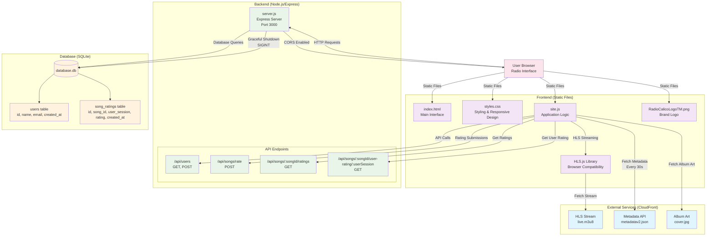

# RadioCalico System Architecture

This document describes the system architecture for the RadioCalico live streaming web application.

## Architecture Overview

RadioCalico is a Node.js-based web application that provides live radio streaming with user interaction features including song ratings and metadata display.

## System Architecture Diagram

## Components

### Frontend
- **Static Files**: HTML, CSS, JavaScript served by Express
- **HLS.js**: JavaScript library for HTTP Live Streaming compatibility
- **User Interface**: Radio controls, metadata display, rating system

### Backend
- **Express Server**: Node.js web server on port 3000
- **REST API**: Endpoints for user management and song ratings
- **CORS**: Cross-origin resource sharing enabled

### Database
- **SQLite**: Local database file (database.db)
- **Tables**: Users and song ratings with proper relationships

### External Services
- **CloudFront CDN**: Hosts HLS stream, metadata API, and album art
- **Real-time Updates**: Metadata fetched every 30 seconds

## Data Flow

1. **Streaming**: Browser fetches HLS stream via HLS.js library
2. **Metadata**: JavaScript polls metadata API every 30 seconds
3. **User Interaction**: Rating submissions sent to backend API
4. **Data Persistence**: User data and ratings stored in SQLite database
5. **Real-time Updates**: Album art and track information updated dynamically

## Security Features

- CORS configuration for cross-origin requests
- Input validation on API endpoints
- Session-based user tracking (localStorage)
- Graceful database connection handling